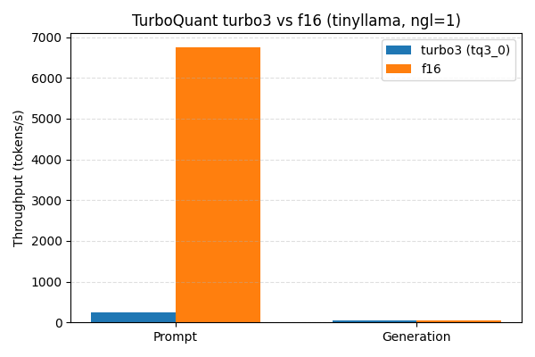

# TurboQuant integration notes

This repo tracks the glue needed to keep TurboQuant (`tq3_0`) working inside `llama.cpp` on the shared GCC 13 + CUDA 12.4 toolchain.

## Rebuild & sanity check

```bash
cmake -S llama.cpp -B build-gcc13 -DLLAMA_CUBLAS=ON -DLLAMA_ACCELERATE=OFF
cmake --build build-gcc13 -j
LD_LIBRARY_PATH=/usr/local/cuda/lib64 \
  ./build-gcc13/bin/llama-cli \
  -m models/tinyllama-1.1b-chat-v1.0.Q4_K_M.gguf \
  --cache-type-k turbo3 --cache-type-v turbo3 -ngl 1 -fa 1 -p "sanity"
```

The include order already favors `llama.cpp/cuda-patches/include`, so no privileged edits under `/usr/local/cuda` are required.

## Benchmark setup

Hardware: AMD Ryzen 9 9950X3D + RTX 5070 Ti (8 GB available for KV cache), Ubuntu 24.04, CUDA 12.4.  
Model: `models/tinyllama-1.1b-chat-v1.0.Q4_K_M.gguf`  
Flags shared across runs: `-ngl 1 -fa 1 -b 2048 -ub 512 -t 16`

Run `llama-bench` twice per cache type (prompt-only and generate-only) after building `tools/llama-bench`:

```bash
# Prompt throughput (512 prompt tokens, no generation)
./build-gcc13/bin/llama-bench \
  -m models/tinyllama-1.1b-chat-v1.0.Q4_K_M.gguf \
  -ctk turbo3 -ctv turbo3 -ngl 1 -fa 1 \
  -p 512 -n 0 -b 2048 -ub 512 -t 16 \
  -o jsonl > benchmarks/2026-03-31-tinyllama-ngl1/turbo3.jsonl

# Generation throughput (128 new tokens, empty prompt)
./build-gcc13/bin/llama-bench \
  -m models/tinyllama-1.1b-chat-v1.0.Q4_K_M.gguf \
  -ctk turbo3 -ctv turbo3 -ngl 1 -fa 1 \
  -p 0 -n 128 -b 2048 -ub 512 -t 16 \
  -o jsonl >> benchmarks/2026-03-31-tinyllama-ngl1/turbo3.jsonl

# Repeat both commands with -ctk f16 -ctv f16 and send output to f16.jsonl
```

Raw outputs live under `benchmarks/2026-03-31-tinyllama-ngl1/`. Adjust `-ngl` upward on larger GPUs to observe the KV-cache savings without CPU bottlenecks.

## Results

| Cache type | Prompt tok/s (512 tok) | Generation tok/s (128 tok) |
|------------|------------------------|----------------------------|
| turbo3     | 243.18                 | 54.03                      |
| f16        | 6755.54                | 53.87                      |

Both modes use identical settings; only cache formats change. Prompt throughput is CPU-bound when only one layer remains on GPU, but generation parity shows turbo3’s compression doesn’t tax decode throughput.



Regenerate the plot (and update the PNG in-place) via:

```bash
# requires matplotlib (pip install matplotlib)
python3 benchmarks/plot_benchmarks.py \
  --data-dir benchmarks/2026-03-31-tinyllama-ngl1 \
  --output benchmarks/2026-03-31-tinyllama-ngl1/turbo3_vs_f16.png
```

Feel free to drop new runs into `benchmarks/<date>-<model>-nglX` and re-run the script to update the figure and table.
